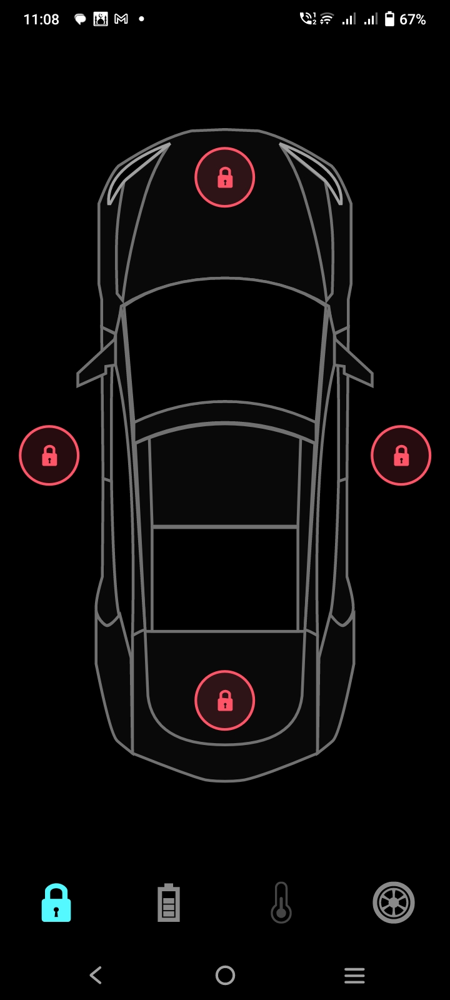
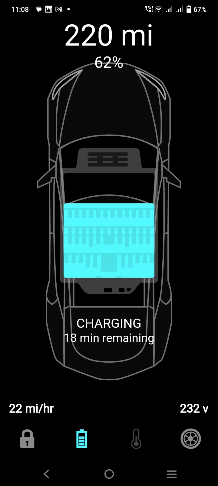
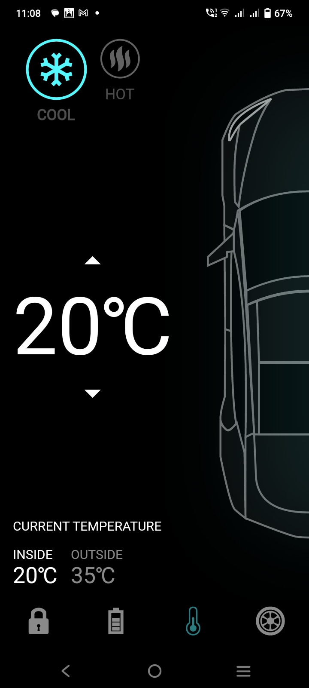
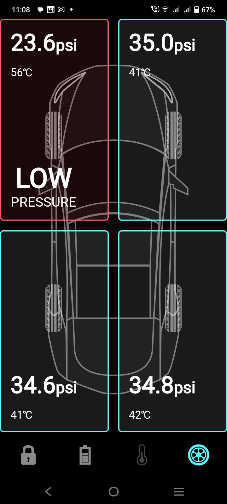

# Tesla_clone

I am happy to share with you my first animation project in flutter, this tesla clone.
use animation controller.

## ScreenShots

<table>
    <tr>
        <td></td>
        <td></td>
    </tr>
    <tr>
        <td></td>
        <td></td>
        
    </tr>
</table>

## Building

-Install Flutter
- `flutter pub get`
- `flutter run`
